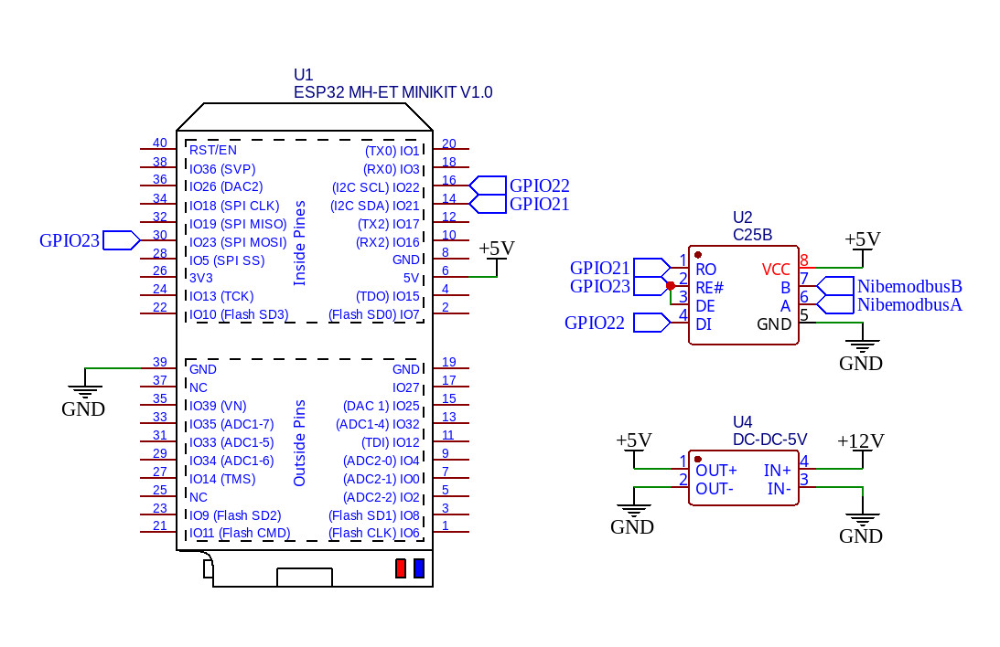
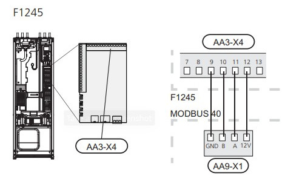

# Esphome-blueprints

## [Elmatare](elmatare.yaml)
Esphome code for use with the custom integration [esphome-p1reader](https://github.com/psvanstrom/esphome-p1reader/) by [psvanstrom](https://github.com/psvanstrom).

The blueprint currently creates the following sersors for use in Home Assistant.

| Name | Unit |
| --- | --- |
| Cumulative Active Import | kWh |
| Cumulative Active Export | kWh |
| Cumulative Reactive Import |kvarh |
| Cumulative Reactive Export | kvarh |
| Effect | kW |
| Momentary Active Export | kW |
| Momentary Reactive Import |kvar |
| Momentary Reactive Export | kvar |
| Effect Phase 1 | kW |
| Momentary Active Export Phase_1 | kW |
| Effect Phase 2 | kW |
| Momentary Active Export Phase_2 | kW |
| Effect Phase 3 | kW |
| Momentary Active Export Phase_3 | kW |
| Momentary Reactive Import_Phase_1 | kvar |
| Momentary Reactive Export_phase_1 | kvar |
| Momentary Reactive Import_Phase_2 | kvar |
| Momentary Reactive Export_phase_2 | kvar |
| Momentary Reactive Import_Phase_3 | kvar | 
| Momentary Reactive Export_phase_3 | kvar |
| Voltage Phase 1 | V |
| Voltage Phase 2 | V |
| Voltage Phase 3 | V |
| Current Phase 1 | A |
| Current Phase 2 | A |
| Current Phase 3 | A |

## [NibeGw](nibegw.yaml)
Esphome code for use with Home Assistant integration [Nibe Heat Pump](https://www.home-assistant.io/integrations/nibe_heatpump)

[ESPHome component](https://github.com/elupus/esphome-nibe)

Schematic

Modbus connections on Nibe F1245

